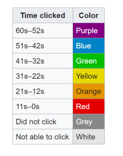
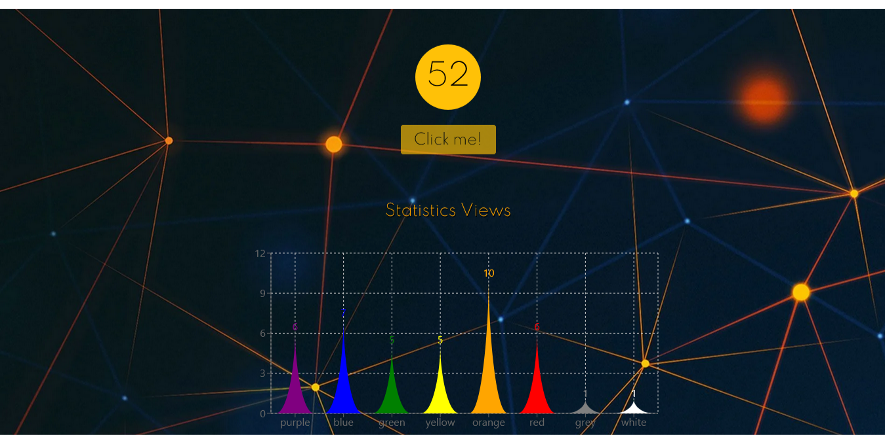
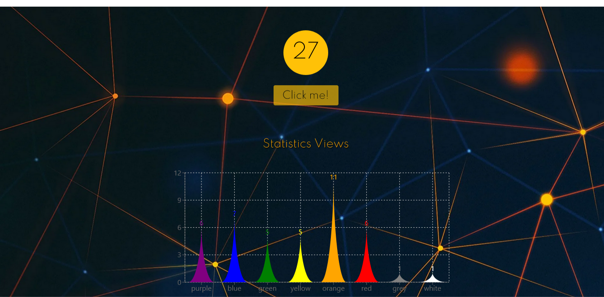

# ***April fools day***

## Aplicación diseñada en [React](https://es.reactjs.org/). 

💡***Funcionamiento de la aplicación***

📍###### El contador desciende de 60 segundos a 0 y solo se resetea si alguien con la página abierta presiona el botón. Solo se puede presionar una vez por usuario y cuando un usuario lo presiona le queda asignado como recuerdo un color en función de esta tabla.

📍###### El 'clickeo' del botón es una acción irreversible. Se desea evitar presiones accidentales. 

📍###### Al clickear se  asigna el color acorde a cuando se formula el click.

📍###### Se simulan clicks de otra gente. O sea al abrir la página, se ve cómo el contador desciende de 60 hasta que se simula el click de la otra persona, lo que hace que el timer se resetee. Para simular el click, se utilizaron numeros aleatorios que pueden ser negativos, en ese caso, se simula que el usuario a presionado el botón fuera de tiempo, asignándole el color "grey", que figura en la tabla de colores asignados por tiempo. 

📍###### Una vez que el usuario clickeó, se mostrará una estadística o visualización relacionada a cuantos usuarios clickearon cada color.

📍###### Si el usuario cierra la página y la reabre se guarda esa sesión en el localStorage, por lo tanto el usuario no podrá volver a hacer "click", deshabilitado así el botón.

👉## Haciendo click [aquí]() podrás comenzar a disfrutar este proyecto! 

📌 ***Este proyecto utiliza las siguientes dependencias:.*** 

📁 [react-bootstrap](https://react-bootstrap.netlify.app/getting-started/introduction/)
 

📁  [recharts](https://recharts.org/en-US/)

  

## 👨‍💻 Si querés tener el código en tu computadora, deberás seguir estos pasos en tu terminal:

 ✔️Ir al repositorio
  
 ✔️Darle click al botón de forkear
  
 ✔️Darle click al botón de code
  
 ✔️Abrir tu terminal y poner el comando de git clone <url>
  
 ✔️Entrar a la carpeta del proyecto y abrirlo en tu IDE 
  

  

## 👩‍💻 En el directorio del proyecto, podés ejecutar:

✔️ ### `npm install`

✔️ ### `npm start`

Ejecuta la aplicación en el modo de desarrollo. 
Abrí [http://localhost:3000](http://localhost:3000) para verlo en el navegador.

### Y listo! Podrás disfrutar de este proyecto!